# Praktikum Modul 2 Jaringan Komputer

Perkenalkan kami dari kelas ``Jaringan Komputer D Kelompok D03``, dengan anggota sebagai berikut:


| Nama                      | NRP        |  Github  | 
|---------------------------|------------|  ------  |
|Alfan Lukeyan Rizki        | 5025211046 |  https://github.com/AlfanLukeyan
|Dimas Prihady Setyawan     | 5025211184 |  https://github.com/yaboidimsum

## Daftar Isi
- [Official Report](#laporan-resmi)
  - [Menu](#daftar-isi)
  - [Topology](#topology)
  - [Node Config](#config)
  - [Prerequisite](#prerequisite)
- [Question 1 - DNS](#Soal-1)
  - [Script Solution](#script)
  - [Test Result](#result)
- [Question 2 - DNS](#Soal-2)
  - [Script Solution](#script-1)
  - [Test Result](#result-1)
- [Question 3 - DNS](#Soal-3)
  - [Script Solution](#script-2)
  - [Test Result](#result-2)
- [Question 4 - DNS](#Soal-4)
  - [Script Solution](#script-3)
  - [Test Result](#result-3)
- [Question 5 - DNS](#Soal-5)
  - [Script Solution](#script-4)
  - [Test Result](#result-4)
- [Question 6 - DNS](#Soal-6)
  - [Script Solution](#script-5)
  - [Test Result](#result-5)
- [Question 7 - DNS](#Soal-7)
  - [Script Solution](#script-6)
  - [Test Result](#result-6)
- [Question 8 - DNS](#Soal-8)
  - [Script Solution](#script-7)
  - [Test Result](#result-7)
- [Question 9 - Webserver](#Soal-9)
  - [Script Solution](#script-8)
  - [Test Result](#result-8)
- [Question 10 - Webserver](#Soal-10)
  - [Script Solution](#script-9)
  - [Test Result](#result-9)
- [Question 11 - Webserver](#Soal-11)
  - [Script Solution](#script-10)
  - [Test Result](#result-10)
- [Question 12 - Webserver](#Soal-12)
  - [Script Solution](#script-11)
  - [Test Result](#result-11)
- [Question 13 - Webserver](#Soal-13)
  - [Script Solution](#script-12)
  - [Test Result](#result-12)
- [Question 14 - Webserver](#Soal-14)
  - [Script Solution](#script-13)
  - [Test Result](#result-13)
- [Question 15 - Webserver](#Soal-15)
  - [Script Solution](#script-14)
  - [Test Result](#result-14)
- [Question 16 - Webserver](#Soal-16)
  - [Script Solution](#script-15)
  - [Test Result](#result-15)
- [Question 17 - Webserver](#Soal-17)
  - [Script Solution](#script-16)
  - [Test Result](#result-16)
- [Question 18 - Webserver](#Soal-18)
  - [Script Solution](#script-17)
  - [Test Result](#result-17)
- [Question 19 - Webserver](#Soal-19)
  - [Script Solution](#script-18)
  - [Test Result](#result-18)
- [Question 20 - Webserver](#Soal-20)
  - [Script Solution](#script-19)
  - [Test Result](#result-19)


### Topology
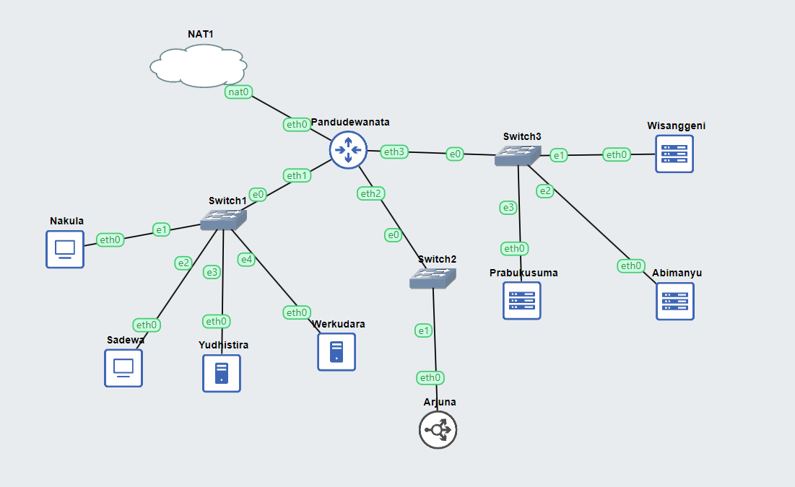

### Config
- Router
    - Pandudewanata
- Switch 1
    - Nakula
        ```
        auto eth0
            iface eth0 inet static
            address 10.23.1.2
            netmask 255.255.255.0
            gateway 10.23.1.1
        ```
    - Sadewa
        ```
        auto eth0
        iface eth0 inet static
            address 10.23.1.3
            netmask 255.255.255.0
            gateway 10.23.1.1
        ```
    - Yudhistira
        ```
        auto eth0
        iface eth0 inet static
            address 10.23.1.4
            netmask 255.255.255.0
            gateway 10.23.1.1
            up echo nameserver 192.168.122.1 > /etc/resolv.conf
        ```
    - Werkudara
        ```
        auto eth0
        iface eth0 inet static
            address 10.23.1.5
            netmask 255.255.255.0
            gateway 10.23.1.1
            up echo nameserver 192.168.122.1 > /etc/resolv.conf
        ```
- Switch 2
    - Arjuna
        ```
        auto eth0
        iface eth0 inet static
            address 10.23.2.2
            netmask 255.255.255.0
            gateway 10.23.2.1
            up echo nameserver 192.168.122.1 > /etc/resolv.conf
        ```
- Switch 3
    - Prabukusuma
        ```
        auto eth0
        iface eth0 inet static
            address 10.23.3.4
            netmask 255.255.255.0
            gateway 10.23.3.1
            up echo nameserver 192.168.122.1 > /etc/resolv.conf
        ```
    - Abimanyu
        ```
        auto eth0
        iface eth0 inet static
            address 10.23.3.3
            netmask 255.255.255.0
            gateway 10.23.3.1
            up echo nameserver 192.168.122.1 > /etc/resolv.conf
        ```
    - Wisanggeni
        ```
        auto eth0
        iface eth0 inet static
            address 10.23.3.2
            netmask 255.255.255.0
            gateway 10.23.3.1
            up echo nameserver 192.168.122.1 > /etc/resolv.conf
        ```
### Prerequisite
- Router (Pandudewanata)
    ```
        iptables -t nat -A POSTROUTING -o eth0 -j MASQUERADE -s 10.23.0.0/16
    ```
- DNS Master & Slave (Yudhistira & Werkudara)
    ```
        apt-get update
        apt-get install bind9 -y    
    ```
- Client (Nakula & Sadewa)
    ```
        echo nameserver 192.168.122.1 > /etc/resolv.conf

        apt-get update -y
        apt-get install dnsutils -y
        apt-get install lynx -y

        echo nameserver 10.23.1.4 > /etc/resolv.conf
        echo nameserver 10.23.1.5 >> /etc/resolv.conf 
    ```

- NGINX Config
    ```
        apt install nginx php php-fpm -y        
    ```

- Webserver Apache2
    ```
    apt-get update
    apt-get install nginx -y
    apt-get install apache2 -y
    apt-get install php php-fpm -y
    apt-get install libapache2-mod-php7.0 -y
    apt-get install unzip -y
    apt-get install wget -y
    apt-get install dnsutils -y

    rm /etc/nginx/sites-enabled/*
    rm /etc/nginx/sites-available/*
    rm /etc/apache2/sites-enabled/*
    rm /etc/apache2/sites-available/*
    ```

- Zip Download & Unzip Web Server Resources
    ```
        wget -O '/var/www/abimanyu.d03.com' 'https://drive.usercontent.google.com/download?id=1a4V23hwK9S7hQEDEcv9FL14UkkrHc-Zc'
        unzip -o /var/www/abimanyu.d03.com -d /var/www/ 
        mv /var/www/abimanyu.yyy.com /var/www/abimanyu.d03
        rm /var/www/abimanyu.d03.com
        rm -rf /var/www/abimanyu.yyy.com

        wget -O '/var/www/parikesit.abimanyu.d03.com' 'https://drive.usercontent.google.com/download?id=1LdbYntiYVF_NVNgJis1GLCLPEGyIOreS'
        unzip -o /var/www/parikesit.abimanyu.d03.com -d /var/www/
        mv /var/www/parikesit.abimanyu.yyy.com /var/www/parikesit.abimanyu.d03
        rm /var/www/parikesit.abimanyu.d03.com
        rm -rf /var/www/parikesit.abimanyu.yyy.com
        mkdir /var/www/parikesit.abimanyu.d03/secret

        wget -O '/var/www/rjp.baratayuda.abimanyu.d03.com' 'https://drive.usercontent.google.com/download?id=1pPSP7yIR05JhSFG67RVzgkb-VcW9vQO6'
        unzip -o /var/www/rjp.baratayuda.abimanyu.d03.com -d /var/www/
        mv /var/www/rjp.baratayuda.abimanyu.yyy.com /var/www/rjp.baratayuda.abimanyu.d03
        rm /var/www/rjp.baratayuda.abimanyu.d03.com
        rm -rf /var/www/rjp.baratayuda.abimanyu.yyy.com
    ```

## Soal-1
> Yudhistira akan digunakan sebagai DNS Master, Werkudara sebagai DNS Slave, Arjuna merupakan Load Balancer yang terdiri dari beberapa Web Server yaitu Prabakusuma, Abimanyu, dan Wisanggeni. Buatlah topologi dengan pembagian sebagai berikut. Folder topologi dapat diakses pada drive berikut 

Sebelum memulai pengerjaan, langkah awal yang perlu dilakukan adalah melakukan setup. Tahap selanjutnya adalah melakukan pengujian terhadap semua node yang ada. Pada tahap ini, pengujian dilakukan pada kedua client, yakni Nakula dan Sadewa.

### Script
```
    ping google.com -c 5
```
### Result
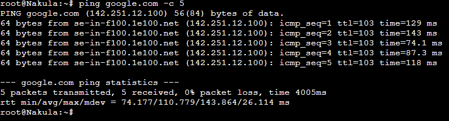
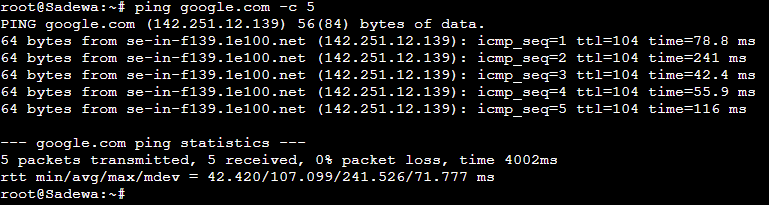

## Soal-2
>Buatlah website utama pada node arjuna dengan akses ke arjuna.yyy.com dengan alias www.arjuna.yyy.com dengan yyy merupakan kode kelompok.

Dilakukan tahap awal setup pada Node Yudhistira (DNS Master) sebelum melanjutkan ke proses pembuatan domain yang tercantum dalam script berikut.

### Script

```
mkdir /etc/bind/main

echo 'zone "arjuna.d03.com" {
        type master;
        file "/etc/bind/main/arjuna.d03.com";
};' > /etc/bind/named.conf.local

echo '
;
; BIND data file for local loopback interface
;
$TTL    604800
@       IN      SOA     arjuna.d03.com. root.arjuna.d03.com. (
                        2023100902      ; Serial
                         604800         ; Refresh
                          86400         ; Retry
                        2419200         ; Expire
                         604800 )       ; Negative Cache TTL
;
@       IN      NS      arjuna.d03.com.
@       IN      A       10.23.2.2     ; IP Arjuna
www     IN      CNAME   arjuna.d03.com.' > /etc/bind/jarkom/arjuna.d03.com

service bind9 restart
```

Pastikan nameserver client pada ``/etc/resov.conf`` telah mengarah ke `IP Node Yudhistira`
```
nameserver 10.23.1.4
```
Lakukan Ping pada client untuk memastikan domain telah berjalan dengan baik.
```
ping arjuna.d03.com
ping www.arjuna.d03.com
```
### Result
**Nakula**

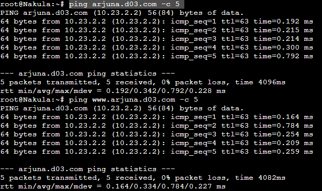

**Sadewa**

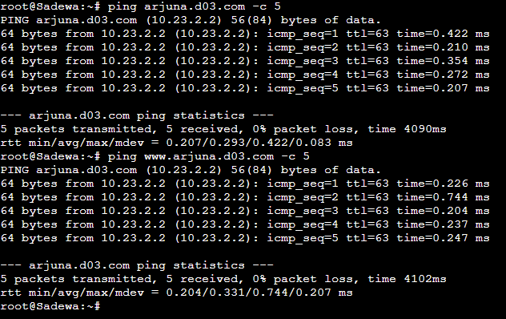

## Soal-3
>Dengan cara yang sama seperti soal nomor 2, buatlah website utama dengan akses ke abimanyu.yyy.com dan alias www.abimanyu.yyy.com.

Langkah-langkah implementasi tetap sama seperti yang telah dijelaskan pada Pertanyaan 2, dengan satu-satunya perbedaan terletak pada nama domain yang digunakan.

### Script
```
echo 'zone "abimanyu.d03.com" {
        type master;
        file "/etc/bind/main/aabimanyu.d03.com";
};' > /etc/bind/named.conf.local

echo '
;
; BIND data file for local loopback interface
;
$TTL    604800
@       IN      SOA     abimanyu.d03.com. root.abimanyu.d03.com. (
                        2023100902      ; Serial
                         604800         ; Refresh
                          86400         ; Retry
                        2419200         ; Expire
                         604800 )       ; Negative Cache TTL
;
@       IN      NS      abimanyu.d03.com.
@       IN      A       10.23.3.3    ; IP Arjuna
www     IN      CNAME   abimanyu.d03.com.' > /etc/bind/jarkom/abimanyu.d03.com

service bind9 restart
```
### Result

**Nakula**

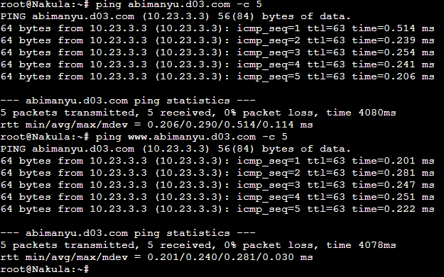

**Sadewa**

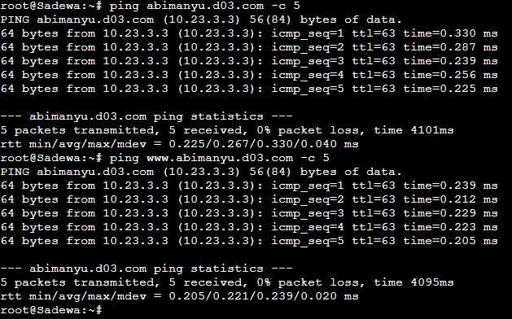

## Soal-4
>Kemudian, karena terdapat beberapa web yang harus di-deploy, buatlah subdomain parikesit.abimanyu.yyy.com yang diatur DNS-nya di Yudhistira dan mengarah ke Abimanyu.

Untuk membuat subdomain pada domain abimanyu.yyy.com, diperlukan penambahan baris baru dengan nama 'parikesit' pada file abimanyu.d03.com dengan tipe A.

### Script
```
echo 'zone "abimanyu.d03.com" {
        type master;
        file "/etc/bind/main/abimanyu.d03.com";
};' > /etc/bind/named.conf.local

echo '
;
; BIND data file for local loopback interface
;
$TTL    604800
@       IN      SOA     abimanyu.d03.com. root.abimanyu.d03.com. (
                        2023100902      ; Serial
                         604800         ; Refresh
                          86400         ; Retry
                        2419200         ; Expire
                         604800 )       ; Negative Cache TTL
;
@       IN      NS      abimanyu.d03.com.
@       IN      A       10.23.3.3    ; IP Arjuna
www     IN      CNAME   abimanyu.d03.com.
www.parikesit   IN      CNAME   parikesit.abimanyu.d03.com.
parikesit       IN      A       10.23.3.3      ; IP Abimanyu
' > /etc/bind/jarkom/abimanyu.d03.com


service bind9 restart
```
Lalu lakuan ping pada client untuk memastikan subdomain telah berjalan dengan baik.


### Result

**Nakula**

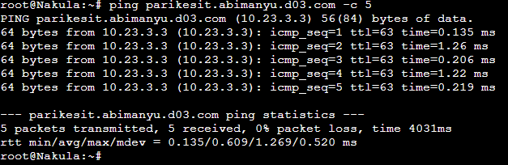

**Sadewa**

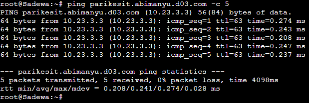

## Soal-5
>Buat juga reverse domain untuk domain utama. (Abimanyu saja yang direverse)

Untuk melakukan konfigurasi reverse domain, kami perlu mengetahui IP dari Abimanyu. IP Abimanyu dalam kelompok kami adalah 10.23.3.3, oleh karena itu, kami perlu mengubahnya menjadi 3.3.23.10.

### Script
```
echo 'zone "3.23.10.in-addr.arpa" {
        type master;
        file "/etc/bind/main/3.23.10.in-addr.arpa";
};
' > /etc/bind/named.conf.local

echo '
;
; BIND data file for local loopback interface
;
$TTL  604800
@   IN      SOA     abimanyu.d03.com.  root.abimanyu.d03.com. (
                    2023100902      ; Serial
                        604800      ; Refresh
                        86400       ; Retry 
                        2419200     ; Expire
                        604800  )   ; Negative Cache TTL
;
3.23.10.in-addr.arpa.    IN  NS     abimanyu.d03.com.
3                        IN  PTR    abimanyu.d03.com.
' > /etc/bind/main/3.23.10.in-addr.arpa
```

Lakukan command berikut pada client untuk memastikan reverse domain telah berjalan dengan baik.

```
host -t PTR 10.23.3.3
```


### Result

**Nakula**

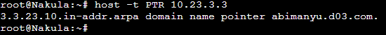

**Sadewa**

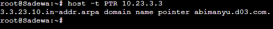

## Soal-6
>Agar dapat tetap dihubungi ketika DNS Server Yudhistira bermasalah, buat juga Werkudara sebagai DNS Slave untuk domain utama.

Untuk melakukan konfigurasi DNS Slave, diperlukan beberapa pengaturan pada `DNS Master(Yudhistira)` dan `DNS Slave (Werkudara)`.

### Script

Langkah awal adalah menambahkan konfigurasi 'notify', 'also-notify', dan 'allow-transfer' agar memberikan izin kepada IP yang dituju.

**DNS Master (Yudhistira)**
```
echo 'zone "arjuna.d03.com" {
        type master;
        also-notify { 10.23.1.5; };
        allow-transfer { 10.23.1.5; };
        file "/etc/bind/main/arjuna.d03.com";
};

zone "abimanyu.d03.com" {
        type master;
        also-notify { 10.23.1.5; };
        allow-transfer { 10.23.1.5; };
        file "/etc/bind/main/abimanyu.d03.com";
};

zone "3.23.10.in-addr.arpa" {
        type master;
        file "/etc/bind/main/3.23.10.in-addr.arpa";
};
' > /etc/bind/named.conf.local

service bind9 restart
service bind9 stop
```
Service pada DNS Master dihentikan untuk memastikan konfigurasi telah berjalan dengan baik pada DNS Slave.

**DNS Slave (Werkudara)**
```
echo 'zone "abimanyu.d03.com" {
    type slave;
    masters { 10.23.1.4; };
    file "/var/lib/bind/abimanyu.d03.com";
};

zone "arjuna.d03.com" {
    type slave;
    masters { 10.23.1.4; };
    file "/var/lib/bind/arjuna.d03.com";
};' > /etc/bind/named.conf.local

service bind9 restart
```
Jika sudah selesai, pengujian dapat dilakukan dengan melakukan ping pada domain yang telah dibuat, seperti Arjuna dan Abimanyu

```
ping arjuna.d03.com -c 5
ping abimanyu.d03.com -c 5
```

### Result

Stop Bind9 **Yudhistira**

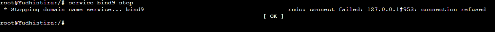

Start Bind9 **Werkudara**

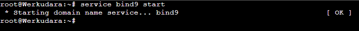

**Nakula**

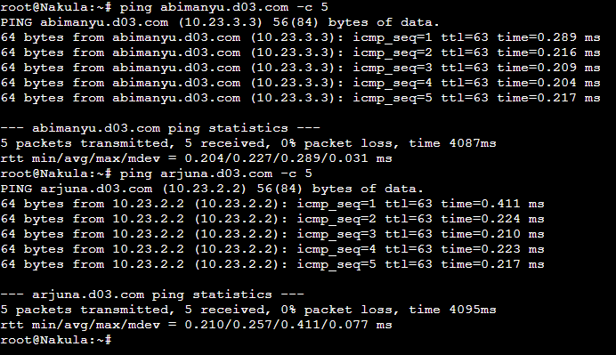

**Sadewa**

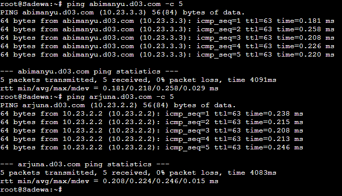


## Soal-7
>Seperti yang kita tahu karena banyak sekali informasi yang harus diterima, buatlah subdomain khusus untuk perang yaitu baratayuda.abimanyu.yyy.com dengan alias www.baratayuda.abimanyu.yyy.com yang didelegasikan dari Yudhistira ke Werkudara dengan IP menuju ke Abimanyu dalam folder Baratayuda.

### Script

### Result


## Soal-8
>Untuk informasi yang lebih spesifik mengenai Ranjapan Baratayuda, buatlah subdomain melalui Werkudara dengan akses rjp.baratayuda.abimanyu.yyy.com dengan alias www.rjp.baratayuda.abimanyu.yyy.com yang mengarah ke Abimanyu.

### Script

### Result


## Soal-9
>Arjuna merupakan suatu Load Balancer Nginx dengan tiga worker (yang juga menggunakan nginx sebagai webserver) yaitu Prabakusuma, Abimanyu, dan Wisanggeni. Lakukan deployment pada masing-masing worker.

### Script

### Result


## Soal-10
>Kemudian gunakan algoritma Round Robin untuk Load Balancer pada Arjuna. Gunakan server_name pada soal nomor 1. Untuk melakukan pengecekan akses alamat web tersebut kemudian pastikan worker yang digunakan untuk menangani permintaan akan berganti ganti secara acak. Untuk webserver di masing-masing worker wajib berjalan di port 8001-8003. Contoh (Prabakusuma:8001, Abimanyu:8002, Wisanggeni:8003)

### Script

### Result


## Soal-11
>Selain menggunakan Nginx, lakukan konfigurasi Apache Web Server pada worker Abimanyu dengan web server www.abimanyu.yyy.com. Pertama dibutuhkan web server dengan DocumentRoot pada /var/www/abimanyu.yyy

### Script

### Result


## Soal-12
>Setelah itu ubahlah agar url www.abimanyu.yyy.com/index.php/home menjadi www.abimanyu.yyy.com/home.

### Script

### Result


## Soal-13
>Selain itu, pada subdomain www.parikesit.abimanyu.yyy.com, DocumentRoot disimpan pada /var/www/parikesit.abimanyu.yyy

### Script

### Result


## Soal-14
>Pada subdomain tersebut folder /public hanya dapat melakukan directory listing sedangkan pada folder /secret tidak dapat diakses (403 Forbidden).

### Script

### Result


## Soal-15
>Buatlah kustomisasi halaman error pada folder /error untuk mengganti error kode pada Apache. Error kode yang perlu diganti adalah 404 Not Found dan 403 Forbidden.

### Script

### Result


## Soal-16
>Buatlah suatu konfigurasi virtual host agar file asset www.parikesit.abimanyu.yyy.com/public/js menjadi www.parikesit.abimanyu.yyy.com/js 

### Script

### Result


## Soal-17
>Agar aman, buatlah konfigurasi agar www.rjp.baratayuda.abimanyu.yyy.com hanya dapat diakses melalui port 14000 dan 14400.

### Script

### Result


## Soal-18
>Untuk mengaksesnya buatlah autentikasi username berupa “Wayang” dan password “baratayudayyy” dengan yyy merupakan kode kelompok. Letakkan DocumentRoot pada /var/www/rjp.baratayuda.abimanyu.yyy.

### Script

### Result


## Soal-19
>Buatlah agar setiap kali mengakses IP dari Abimanyu akan secara otomatis dialihkan ke www.abimanyu.yyy.com (alias)

### Script

### Result


## Soal-20
>Karena website www.parikesit.abimanyu.yyy.com semakin banyak pengunjung dan banyak gambar gambar random, maka ubahlah request gambar yang memiliki substring “abimanyu” akan diarahkan menuju abimanyu.png.

### Script

### Result
