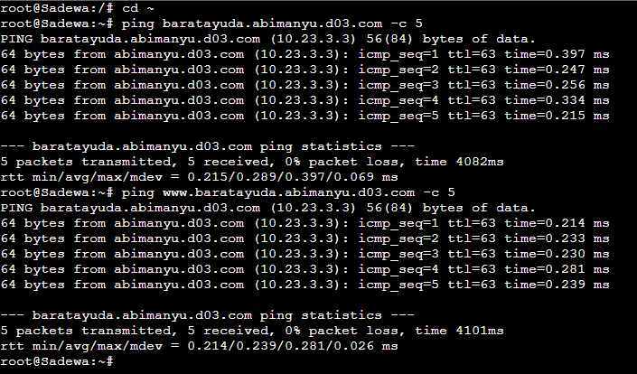
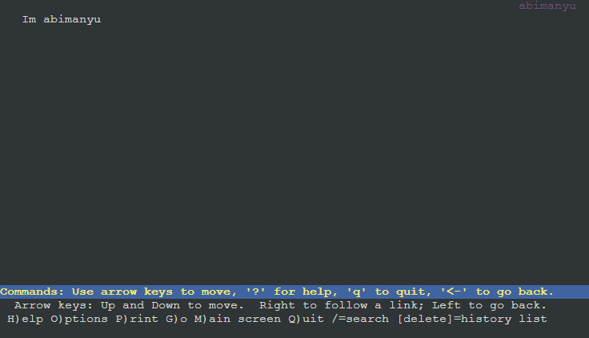

# Praktikum Modul 2 Jaringan Komputer

Perkenalkan kami dari kelas `Jaringan Komputer D Kelompok D03`, dengan anggota sebagai berikut:

| Nama                   | NRP        |
| ---------------------- | ---------- |
| Alfan Lukeyan Rizki    | 5025211046 |
| Dimas Prihady Setyawan | 5025211184 |

## Daftar Isi

- [Official Report](#laporan-resmi)
  - [Menu](#daftar-isi)
  - [Topology](#topology)
  - [Node Config](#config)
  - [Prerequisite](#prerequisite)
- [Question 1 - DNS](#Soal-1)
  - [Script Solution](#script)
  - [Test Result](#result)
- [Question 2 - DNS](#Soal-2)
  - [Script Solution](#script-1)
  - [Test Result](#result-1)
- [Question 3 - DNS](#Soal-3)
  - [Script Solution](#script-2)
  - [Test Result](#result-2)
- [Question 4 - DNS](#Soal-4)
  - [Script Solution](#script-3)
  - [Test Result](#result-3)
- [Question 5 - DNS](#Soal-5)
  - [Script Solution](#script-4)
  - [Test Result](#result-4)
- [Question 6 - DNS](#Soal-6)
  - [Script Solution](#script-5)
  - [Test Result](#result-5)
- [Question 7 - DNS](#Soal-7)
  - [Script Solution](#script-6)
  - [Test Result](#result-6)
- [Question 8 - DNS](#Soal-8)
  - [Script Solution](#script-7)
  - [Test Result](#result-7)
- [Question 9 - Webserver](#Soal-9)
  - [Script Solution](#script-8)
  - [Test Result](#result-8)
- [Question 10 - Webserver](#Soal-10)
  - [Script Solution](#script-9)
  - [Test Result](#result-9)
- [Question 11 - Webserver](#Soal-11)
  - [Script Solution](#script-10)
  - [Test Result](#result-10)
- [Question 12 - Webserver](#Soal-12)
  - [Script Solution](#script-11)
  - [Test Result](#result-11)
- [Question 13 - Webserver](#Soal-13)
  - [Script Solution](#script-12)
  - [Test Result](#result-12)
- [Question 14 - Webserver](#Soal-14)
  - [Script Solution](#script-13)
  - [Test Result](#result-13)
- [Question 15 - Webserver](#Soal-15)
  - [Script Solution](#script-14)
  - [Test Result](#result-14)
- [Question 16 - Webserver](#Soal-16)
  - [Script Solution](#script-15)
  - [Test Result](#result-15)
- [Question 17 - Webserver](#Soal-17)
  - [Script Solution](#script-16)
  - [Test Result](#result-16)
- [Question 18 - Webserver](#Soal-18)
  - [Script Solution](#script-17)
  - [Test Result](#result-17)
- [Question 19 - Webserver](#Soal-19)
  - [Script Solution](#script-18)
  - [Test Result](#result-18)
- [Question 20 - Webserver](#Soal-20)
  - [Script Solution](#script-19)
  - [Test Result](#result-19)

### Topology


### Config

- Router
  - Pandudewanata
- Switch 1
  - Nakula
    ```
    auto eth0
        iface eth0 inet static
        address 10.23.1.2
        netmask 255.255.255.0
        gateway 10.23.1.1
    ```
  - Sadewa
    ```
    auto eth0
    iface eth0 inet static
        address 10.23.1.3
        netmask 255.255.255.0
        gateway 10.23.1.1
    ```
  - Yudhistira
    ```
    auto eth0
    iface eth0 inet static
        address 10.23.1.4
        netmask 255.255.255.0
        gateway 10.23.1.1
        up echo nameserver 192.168.122.1 > /etc/resolv.conf
    ```
  - Werkudara
    ```
    auto eth0
    iface eth0 inet static
        address 10.23.1.5
        netmask 255.255.255.0
        gateway 10.23.1.1
        up echo nameserver 192.168.122.1 > /etc/resolv.conf
    ```
- Switch 2
  - Arjuna
    ```
    auto eth0
    iface eth0 inet static
        address 10.23.2.2
        netmask 255.255.255.0
        gateway 10.23.2.1
        up echo nameserver 192.168.122.1 > /etc/resolv.conf
    ```
- Switch 3
  - Prabukusuma
    ```
    auto eth0
    iface eth0 inet static
        address 10.23.3.4
        netmask 255.255.255.0
        gateway 10.23.3.1
        up echo nameserver 192.168.122.1 > /etc/resolv.conf
    ```
  - Abimanyu
    ```
    auto eth0
    iface eth0 inet static
        address 10.23.3.3
        netmask 255.255.255.0
        gateway 10.23.3.1
        up echo nameserver 192.168.122.1 > /etc/resolv.conf
    ```
  - Wisanggeni
    ```
    auto eth0
    iface eth0 inet static
        address 10.23.3.2
        netmask 255.255.255.0
        gateway 10.23.3.1
        up echo nameserver 192.168.122.1 > /etc/resolv.conf
    ```

### Prerequisite

- Router (Pandudewanata)
  ```
      iptables -t nat -A POSTROUTING -o eth0 -j MASQUERADE -s 10.23.0.0/16
  ```
- DNS Master & Slave (Yudhistira & Werkudara)
  ```
      apt-get update
      apt-get install bind9 -y
  ```
- Client (Nakula & Sadewa)

  ```
      echo nameserver 192.168.122.1 > /etc/resolv.conf

      apt-get update -y
      apt-get install dnsutils -y
      apt-get install lynx -y

      echo nameserver 10.23.1.4 > /etc/resolv.conf
      echo nameserver 10.23.1.5 >> /etc/resolv.conf
  ```

- NGINX Config

  ```
      apt install nginx php php-fpm -y
  ```

- Webserver Apache2

  ```
  apt-get update
  apt-get install nginx -y
  apt-get install apache2 -y
  apt-get install php php-fpm -y
  apt-get install libapache2-mod-php7.0 -y
  apt-get install unzip -y
  apt-get install wget -y
  apt-get install dnsutils -y

  rm /etc/nginx/sites-enabled/*
  rm /etc/nginx/sites-available/*
  rm /etc/apache2/sites-enabled/*
  rm /etc/apache2/sites-available/*
  ```

- Zip Download & Unzip Web Server Resources

  ```
      wget -O '/var/www/abimanyu.d03.com' 'https://drive.usercontent.google.com/download?id=1a4V23hwK9S7hQEDEcv9FL14UkkrHc-Zc'
      unzip -o /var/www/abimanyu.d03.com -d /var/www/
      mv /var/www/abimanyu.yyy.com /var/www/abimanyu.d03
      rm /var/www/abimanyu.d03.com
      rm -rf /var/www/abimanyu.yyy.com

      wget -O '/var/www/parikesit.abimanyu.d03.com' 'https://drive.usercontent.google.com/download?id=1LdbYntiYVF_NVNgJis1GLCLPEGyIOreS'
      unzip -o /var/www/parikesit.abimanyu.d03.com -d /var/www/
      mv /var/www/parikesit.abimanyu.yyy.com /var/www/parikesit.abimanyu.d03
      rm /var/www/parikesit.abimanyu.d03.com
      rm -rf /var/www/parikesit.abimanyu.yyy.com
      mkdir /var/www/parikesit.abimanyu.d03/secret

      wget -O '/var/www/rjp.baratayuda.abimanyu.d03.com' 'https://drive.usercontent.google.com/download?id=1pPSP7yIR05JhSFG67RVzgkb-VcW9vQO6'
      unzip -o /var/www/rjp.baratayuda.abimanyu.d03.com -d /var/www/
      mv /var/www/rjp.baratayuda.abimanyu.yyy.com /var/www/rjp.baratayuda.abimanyu.d03
      rm /var/www/rjp.baratayuda.abimanyu.d03.com
      rm -rf /var/www/rjp.baratayuda.abimanyu.yyy.com
  ```

## Soal-1

> Yudhistira akan digunakan sebagai DNS Master, Werkudara sebagai DNS Slave, Arjuna merupakan Load Balancer yang terdiri dari beberapa Web Server yaitu Prabakusuma, Abimanyu, dan Wisanggeni. Buatlah topologi dengan pembagian sebagai berikut. Folder topologi dapat diakses pada drive berikut

Sebelum memulai pengerjaan, langkah awal yang perlu dilakukan adalah melakukan setup. Tahap selanjutnya adalah melakukan pengujian terhadap semua node yang ada. Pada tahap ini, pengujian dilakukan pada kedua client, yakni Nakula dan Sadewa.

### Script

```
    ping google.com -c 5
```

### Result


## Soal-2

> Buatlah website utama pada node arjuna dengan akses ke arjuna.yyy.com dengan alias www.arjuna.yyy.com dengan yyy merupakan kode kelompok.

Dilakukan tahap awal setup pada Node Yudhistira (DNS Master) sebelum melanjutkan ke proses pembuatan domain yang tercantum dalam script berikut.

### Script

```
mkdir /etc/bind/main

echo 'zone "arjuna.d03.com" {
        type master;
        file "/etc/bind/main/arjuna.d03.com";
};' > /etc/bind/named.conf.local

echo '
;
; BIND data file for local loopback interface
;
$TTL    604800
@       IN      SOA     arjuna.d03.com. root.arjuna.d03.com. (
                        2023100902      ; Serial
                         604800         ; Refresh
                          86400         ; Retry
                        2419200         ; Expire
                         604800 )       ; Negative Cache TTL
;
@       IN      NS      arjuna.d03.com.
@       IN      A       10.23.2.2     ; IP Arjuna
www     IN      CNAME   arjuna.d03.com.' > /etc/bind/jarkom/arjuna.d03.com

service bind9 restart
```

Pastikan nameserver client pada `/etc/resov.conf` telah mengarah ke `IP Node Yudhistira`

```
nameserver 10.23.1.4
```

Lakukan Ping pada client untuk memastikan domain telah berjalan dengan baik.

```
ping arjuna.d03.com
ping www.arjuna.d03.com
```

### Result

**Nakula**


**Sadewa**


## Soal-3

> Dengan cara yang sama seperti soal nomor 2, buatlah website utama dengan akses ke abimanyu.yyy.com dan alias www.abimanyu.yyy.com.

Langkah-langkah implementasi tetap sama seperti yang telah dijelaskan pada Pertanyaan 2, dengan satu-satunya perbedaan terletak pada nama domain yang digunakan.

### Script

```
echo 'zone "abimanyu.d03.com" {
        type master;
        file "/etc/bind/main/aabimanyu.d03.com";
};' > /etc/bind/named.conf.local

echo '
;
; BIND data file for local loopback interface
;
$TTL    604800
@       IN      SOA     abimanyu.d03.com. root.abimanyu.d03.com. (
                        2023100902      ; Serial
                         604800         ; Refresh
                          86400         ; Retry
                        2419200         ; Expire
                         604800 )       ; Negative Cache TTL
;
@       IN      NS      abimanyu.d03.com.
@       IN      A       10.23.3.3    ; IP Arjuna
www     IN      CNAME   abimanyu.d03.com.' > /etc/bind/jarkom/abimanyu.d03.com

service bind9 restart
```

### Result

**Nakula**


**Sadewa**


## Soal-4

> Kemudian, karena terdapat beberapa web yang harus di-deploy, buatlah subdomain parikesit.abimanyu.yyy.com yang diatur DNS-nya di Yudhistira dan mengarah ke Abimanyu.

Untuk membuat subdomain pada domain abimanyu.yyy.com, diperlukan penambahan baris baru dengan nama 'parikesit' pada file abimanyu.d03.com dengan tipe A.

### Script

```
echo 'zone "abimanyu.d03.com" {
        type master;
        file "/etc/bind/main/abimanyu.d03.com";
};' > /etc/bind/named.conf.local

echo '
;
; BIND data file for local loopback interface
;
$TTL    604800
@       IN      SOA     abimanyu.d03.com. root.abimanyu.d03.com. (
                        2023100902      ; Serial
                         604800         ; Refresh
                          86400         ; Retry
                        2419200         ; Expire
                         604800 )       ; Negative Cache TTL
;
@       IN      NS      abimanyu.d03.com.
@       IN      A       10.23.3.3    ; IP Arjuna
www     IN      CNAME   abimanyu.d03.com.
www.parikesit   IN      CNAME   parikesit.abimanyu.d03.com.
parikesit       IN      A       10.23.3.3      ; IP Abimanyu
' > /etc/bind/jarkom/abimanyu.d03.com


service bind9 restart
```

Lalu lakuan ping pada client untuk memastikan subdomain telah berjalan dengan baik.

### Result

**Nakula**


**Sadewa**


## Soal-5

> Buat juga reverse domain untuk domain utama. (Abimanyu saja yang direverse)

Untuk melakukan konfigurasi reverse domain, kami perlu mengetahui IP dari Abimanyu. IP Abimanyu dalam kelompok kami adalah 10.23.3.3, oleh karena itu, kami perlu mengubahnya menjadi 3.3.23.10.

### Script

```
echo 'zone "3.23.10.in-addr.arpa" {
        type master;
        file "/etc/bind/main/3.23.10.in-addr.arpa";
};
' > /etc/bind/named.conf.local

echo '
;
; BIND data file for local loopback interface
;
$TTL  604800
@   IN      SOA     abimanyu.d03.com.  root.abimanyu.d03.com. (
                    2023100902      ; Serial
                        604800      ; Refresh
                        86400       ; Retry
                        2419200     ; Expire
                        604800  )   ; Negative Cache TTL
;
3.23.10.in-addr.arpa.    IN  NS     abimanyu.d03.com.
3                        IN  PTR    abimanyu.d03.com.
' > /etc/bind/main/3.23.10.in-addr.arpa
```

Lakukan command berikut pada client untuk memastikan reverse domain telah berjalan dengan baik.

```
host -t PTR 10.23.3.3
```

### Result

**Nakula**


**Sadewa**


## Soal-6

> Agar dapat tetap dihubungi ketika DNS Server Yudhistira bermasalah, buat juga Werkudara sebagai DNS Slave untuk domain utama.

Untuk melakukan konfigurasi DNS Slave, diperlukan beberapa pengaturan pada `DNS Master(Yudhistira)` dan `DNS Slave (Werkudara)`.

### Script

Langkah awal adalah menambahkan konfigurasi 'notify', 'also-notify', dan 'allow-transfer' agar memberikan izin kepada IP yang dituju.

**DNS Master (Yudhistira)**

```
echo 'zone "arjuna.d03.com" {
        type master;
        also-notify { 10.23.1.5; };
        allow-transfer { 10.23.1.5; };
        file "/etc/bind/main/arjuna.d03.com";
};

zone "abimanyu.d03.com" {
        type master;
        also-notify { 10.23.1.5; };
        allow-transfer { 10.23.1.5; };
        file "/etc/bind/main/abimanyu.d03.com";
};

zone "3.23.10.in-addr.arpa" {
        type master;
        file "/etc/bind/main/3.23.10.in-addr.arpa";
};
' > /etc/bind/named.conf.local

service bind9 restart
service bind9 stop
```

Service pada DNS Master dihentikan untuk memastikan konfigurasi telah berjalan dengan baik pada DNS Slave.

**DNS Slave (Werkudara)**

```
echo 'zone "abimanyu.d03.com" {
    type slave;
    masters { 10.23.1.4; };
    file "/var/lib/bind/abimanyu.d03.com";
};

zone "arjuna.d03.com" {
    type slave;
    masters { 10.23.1.4; };
    file "/var/lib/bind/arjuna.d03.com";
};' > /etc/bind/named.conf.local

service bind9 restart
```

Jika sudah selesai, pengujian dapat dilakukan dengan melakukan ping pada domain yang telah dibuat, seperti Arjuna dan Abimanyu

```
ping arjuna.d03.com -c 5
ping abimanyu.d03.com -c 5
```

### Result

Stop Bind9 **Yudhistira**


Start Bind9 **Werkudara**


**Nakula**


**Sadewa**


## Soal-7

> Seperti yang kita tahu karena banyak sekali informasi yang harus diterima, buatlah subdomain khusus untuk perang yaitu baratayuda.abimanyu.yyy.com dengan alias www.baratayuda.abimanyu.yyy.com yang didelegasikan dari Yudhistira ke Werkudara dengan IP menuju ke Abimanyu dalam folder Baratayuda.

Dalam proses pembuatan delegasi subdomain, diperlukan beberapa konfigurasi pada DNS Master dan DNS Slave. Selain itu, kita memerlukan bantuan konfigurasi 'allow-query { any; };' pada DNS Master dan Slave. Selain itu, NS (Name Server) juga diperlukan karena NS digunakan untuk delegasi zona DNS sehingga dapat menggunakan authoritative name server yang telah ditentukan.

### Script

Perlu menambahkan entri 'ns1 IN A 10.23.1.5' pada file konfigurasi DNS Master agar Werkudara memiliki authoritative terhadapnya. Selain itu, diperlukan aktivasi 'allow-query { any; };' pada konfigurasi DNS Master. Terakhir, perlu mengedit file '/etc/bind/named.conf.local' sesuai kebutuhan

**DNS Master (Yudhistira)**

```
echo '
;
; BIND data file for local loopback interface
;
$TTL  604800
@   IN      SOA     abimanyu.d03.com.  root.abimanyu.d03.com. (
                    2023100902      ; Serial
                        604800      ; Refresh
                        86400       ; Retry
                        2419200     ; Expire
                        604800  )   ; Negative Cache TTL
;
@               IN      NS      abimanyu.d03.com.
@               IN      A       10.23.3.3       ; IP Abimanyu
www             IN      CNAME   abimanyu.d03.com.
www.parikesit   IN      CNAME   parikesit.abimanyu.d03.com.
parikesit       IN      A       10.23.3.3      ; IP Abimanyu
ns1             IN      A       10.23.1.5      ; IP werkudara
baratayuda              NS      ns1
@               IN      AAAA    ::1
' > /etc/bind/main/abimanyu.d03.com

echo 'options{
        directory "/var/cache/bind";

        // dnssec-validation auto;
        allow-query{ any; };
        auth-nxdomain no;
        listen-on-v6{ any; };
};' > /etc/bind/named.conf.options

service bind9 restart
```

Selain itu, perlu juga melakukan konfigurasi pada Node Werkudara untuk mengarahkan zona ke DNS Master sehingga authoritative-nya dapat berfungsi. Pada DNS Slave, diperlukan aktivasi 'allow-query { any; };' sesuai kebutuhan.

**DNS Slave (Werkudara)**

```
echo 'zone "baratayuda.abimanyu.d03.com"{
    type master;
    file "/etc/bind/baratayuda/baratayuda.abimanyu.d03.com";
};
' > /etc/bind/named.conf.local

mkdir /etc/bind/baratayuda

echo '
;
; BIND data file for local loopback interface
;
$TTL  604800
@   IN      SOA     baratayuda.abimanyu.d03.com.  root.baratayuda.abimanyu.d03.com. (
                    2023100601      ; Serial
                        604800      ; Refresh
                        86400       ; Retry
                        2419200     ; Expire
                        604800  )   ; Negative Cache TTL
;
@   IN      NS      baratayuda.abimanyu.d03.com.
@   IN      A       10.23.3.3       ;
www IN      CNAME   baratayuda.abimanyu.d03.com.
' > /etc/bind/baratayuda/baratayuda.abimanyu.d03.com

echo 'options{
        directory "/var/cache/bind";

        // dnssec-validation auto;
        allow-query{any;};
        auth-nxdomain no;
        listen-on-v6{ any; };
};' > /etc/bind/named.conf.options
```

### Result

**Nakula**


**Sadewa**



## Soal-8

> Untuk informasi yang lebih spesifik mengenai Ranjapan Baratayuda, buatlah subdomain melalui Werkudara dengan akses rjp.baratayuda.abimanyu.yyy.com dengan alias www.rjp.baratayuda.abimanyu.yyy.com yang mengarah ke Abimanyu.

Karena sebelumnya telah dilakukan delegasi pada DNS Slave, dan sekarang perlu menambahkan subdomain untuk delegasi domain tersebut, maka diperlukan penambahan konfigurasi pada DNS Slave seperti yang berikut

### Script

```
rjp             IN      A       10.23.3.3     ; IP Abimanyu
www.rjp         IN      CNAME   rjp.baratayuda.abimanyu.d03.com.
```

**DNS Slave (Werkudara)**

```
echo '
;
; BIND data file for local loopback interface
;
$TTL  604800
@   IN      SOA     baratayuda.abimanyu.d03.com.  root.baratayuda.abimanyu.d03.com. (
                    2023100601      ; Serial
                        604800      ; Refresh
                        86400       ; Retry
                        2419200     ; Expire
                        604800  )   ; Negative Cache TTL
;
@   IN      NS      baratayuda.abimanyu.d03.com.
@   IN      A       10.23.3.3       ;
www IN      CNAME   baratayuda.abimanyu.d03.com.
rjp IN      A       10.23.3.3       ;
www.rjp     IN      CNAME   rjp.baratayuda.abimanyu.d03.com.
' > /etc/bind/baratayuda/baratayuda.abimanyu.d03.com

service bind9 restart
```

### Result

Setelah berhasil menambahkannya dan melakukan restart bind9, untuk melakukan pengujian, Anda dapat cukup melakukan ping pada rjp.baratayuda.abimanyu.d03.com atau www.rjp.baratayuda.abimanyu.d03.com."

**Nakuula**


**Sadewa**


## Soal-9

> Arjuna merupakan suatu Load Balancer Nginx dengan tiga worker (yang juga menggunakan nginx sebagai webserver) yaitu Prabakusuma, Abimanyu, dan Wisanggeni. Lakukan deployment pada masing-masing worker.

Untuk melakukan konfigurasi load balancing, langkah-langkah berikut perlu diperhatikan:

1. Pastikan telah melakukan konfigurasi Arjuna dengan benar, termasuk konfigurasi Nginx dan menentukan aturan load balancing yang sesuai, misalnya round-robin atau algoritma lainnya.

2. Selanjutnya, lakukan proses deployment pada masing-masing worker. Ini melibatkan mengunggah aplikasi atau layanan web yang ingin di-load balance ke setiap worker. Pastikan bahwa semua worker telah diatur dengan benar dan siap melayani lalu lintas web.

3. Setelah semua konfigurasi dan deployment selesai, Arjuna akan bertindak sebagai load balancer yang akan mendistribusikan lalu lintas web ke worker yang tersedia.

### Script

Jangan lupa untuk menghindari tabrakan port dengan konfigurasi default yang ada saat menginstal Nginx, langkah yang perlu diambil adalah menghapus file konfigurasi default tersebut.

**Arjuna (Load Balancer)**

Membuat load balancing

```shell
echo '
upstream worker {
        server 10.23.3.2;
        server 10.23.3.3;
        server 10.23.3.4;
}

server {
    listen 80;

    server_name arjuna.d03.com www.arjuna.d03.com;

    location / {
        proxy_pass http://worker;
    }
}' > /etc/nginx/sites-available/arjuna.d03.com

ln -s /etc/nginx/sites-available/arjuna.d03.com /etc/nginx/sites-enabled

service nginx restart
```

**Prabakusuma (Worker)**

```shell
apt-get update
apt-get install nginx -y
apt-get install unzip -y
apt-get install php php-fpm -y
apt-get install dnsutils -y

rm /etc/nginx/sites-enabled/*
rm /etc/nginx/sites-available/*

service php7.2-fpm start

echo '
<!DOCTYPE html>
<html lang="en">
<head>
    <meta charset="UTF-8">
    <meta name="viewport" content="width=device-width, initial-scale=1.0">
    <title>prabukusuma</title>
</head>
<body>
    Im prabukusuma
</body>
</html>
' > /var/www/html/index.html

echo '
server {
    listen 80;
    root /var/www/html/;
    index index.html index.htm;
    server_name _;

    location / {
        try_files $uri $uri/ =404;
    }

    error_log /var/log/nginx/prabukusuma_error.log;
    access_log /var/log/nginx/prabukusuma_access.log;
}
 ' > /etc/nginx/sites-available/prabukusuma.d03.com

 ln -s /etc/nginx/sites-available/prabukusuma.d03.com /etc/nginx/sites-enabled/

 service nginx restart
```

**Abimanyu (Worker)**

```shell

apt-get update
apt-get install nginx -y
apt-get install apache2 -y
apt-get install php php-fpm -y
apt-get install libapache2-mod-php7.0 -y
apt-get install unzip -y
apt-get install wget -y
apt-get install dnsutils -y

rm /etc/nginx/sites-enabled/*
rm /etc/nginx/sites-available/*
rm /etc/apache2/sites-enabled/*
rm /etc/apache2/sites-available/*

service php7.2-fpm start

a2enmod rewrite
echo '
<!DOCTYPE html>
<html lang="en">
<head>
    <meta charset="UTF-8">
    <meta name="viewport" content="width=device-width, initial-scale=1.0">
    <title>abimanyu</title>
</head>
<body>
    Im abimanyu
</body>
</html>
' > /var/www/html/index.html

echo '
server {
    listen 80;
    root /var/www/html/;
    index index.html index.htm;
    server_name _;

    location / {
        try_files $uri $uri/ =404;
    }

    error_log /var/log/nginx/abimanyu_error.log;
    access_log /var/log/nginx/abimanyu_access.log;
}
 ' > /etc/nginx/sites-available/abimanyu.d03.com

ln -s /etc/nginx/sites-available/abimanyu.d03.com /etc/nginx/sites-enabled

service nginx restart

```

**Wisanggeni (Worker)**

```shell
apt-get update
apt-get install nginx -y
apt-get install unzip -y
apt-get install php php-fpm -y
apt-get install dnsutils -y

rm /etc/nginx/sites-enabled/*
rm /etc/nginx/sites-available/*

service php7.2-fpm start

echo '
<!DOCTYPE html>
<html lang="en">
<head>
    <meta charset="UTF-8">
    <meta name="viewport" content="width=device-width, initial-scale=1.0">
    <title>wisanggeni</title>
</head>
<body>
    Im wisanggeni
</body>
</html>
' > /var/www/html/index.html

echo '
server {
    listen 80;
    root /var/www/html/;
    index index.html index.htm;  # Remove index.php from here
    server_name _;

    location / {
        try_files $uri $uri/ =404;  # Adjust the try_files directive as needed
    }

    error_log /var/log/nginx/wisanggeni_error.log;
    access_log /var/log/nginx/wisanggeni_access.log;
}
 ' > /etc/nginx/sites-available/wisanggeni.d03.com

 ln -s /etc/nginx/sites-available/wisanggeni.d03.com /etc/nginx/sites-enabled
 
 service nginx restart
```

### Result

Lakukan tes pada client Nakula dan Sadewa.
```shell
lynx http://10.23.3.2
lynx http://10.23.3.3
lynx http://10.23.3.4
lynx http://abimanyu.d03.com
```
**Nakula**

Tampilan Prabakusuma


Tampilan Abimanyu


Tampilan Wisanggeni


**Sadewa**

Tampilan Prabakusuma


Tampilan Abimanyu


Tampilan Wisanggeni


## Soal-10

> Kemudian gunakan algoritma Round Robin untuk Load Balancer pada Arjuna. Gunakan server_name pada soal nomor 1. Untuk melakukan pengecekan akses alamat web tersebut kemudian pastikan worker yang digunakan untuk menangani permintaan akan berganti ganti secara acak. Untuk webserver di masing-masing worker wajib berjalan di port 8001-8003. Contoh (Prabakusuma:8001, Abimanyu:8002, Wisanggeni:8003)

Setelah berhasil melakukan deployment pada setiap worker, untuk menerapkan metode Round Robin dan menentukan port untuk setiap worker, kita hanya perlu mengubah beberapa konfigurasi pada load balancer Arjuna dan ketiga worker tersebut.

### Script

"Untuk mengkonfigurasi load balancer Arjuna, kita dapat memodifikasinya sebagai berikut. Pada setiap baris server worker, tambahkan ':800X', dengan X mewakili angka dari 1 hingga 3, untuk membedakan port pada masing-masing worker.

```shell
echo '
upstream worker {
        server 10.23.3.2:8003;
        server 10.23.3.3:8002;
        server 10.23.3.4:8001;
}

server {
    listen 80;

    server_name arjuna.d03.com www.arjuna.d03.com;

    location / {
        proxy_pass http://worker;
    }
}' > /etc/nginx/sites-available/arjuna.d03.com

ln -s /etc/nginx/sites-available/arjuna.d03.com /etc/nginx/sites-enabled

service nginx restart
```

Adapun pada konfigurasi worker, terdapat tambahan keterangan terkait port yang digunakan. Dalam konfigurasi ini, perhatikan baris `listen 800X`, di mana X adalah angka yang disesuaikan dengan port masing-masing worker. Selain itu, tambahkan perintah 'echo' yang ketiga, yang akan menampilkan pesan tambahan terkait port yang digunakan oleh setiap worker.

```shell
service php7.2-fpm start

echo '
<!DOCTYPE html>
<html lang="en">
<head>
    <meta charset="UTF-8">
    <meta name="viewport" content="width=device-width, initial-scale=1.0">
    <title>wisanggeni</title>
</head>
<body>
    Im [Nama Worker]
</body>
</html>
' > /var/www/html/index.html

echo '
server {
    listen 800X;
    root /var/www/html/;
    index index.html index.htm;  # Remove index.php from here
    server_name _;

    location / {
        try_files $uri $uri/ =404;  # Adjust the try_files directive as needed
    }

    error_log /var/log/nginx/wisanggeni_error.log;
    access_log /var/log/nginx/wisanggeni_access.log;
}
 ' > /etc/nginx/sites-available/wisanggeni.d03.com

 ln -s /etc/nginx/sites-available/wisanggeni.d03.com /etc/nginx/sites-enabled
 
 service nginx restart
```
### Result

Jalankan perintah berikut pada client untuk melakukan pengujian.

```shell
lynx http://10.23.3.4:8001
lynx http://10.23.3.3:8002
lynx http://10.23.3.2:8003
lynx http://arjuna.d03.com
```

**Nakula**

Tampilan Prabakusuma


Tampilan Abimanyu


Tampilan Wisanggeni


**Sadewa**

Tampilan Prabakusuma


Tampilan Abimanyu


Tampilan Wisanggeni


## Soal-11

> Selain menggunakan Nginx, lakukan konfigurasi Apache Web Server pada worker Abimanyu dengan web server www.abimanyu.yyy.com. Pertama dibutuhkan web server dengan DocumentRoot pada /var/www/abimanyu.yyy

Pastikan kita melakukan [Prerequisite](#prerequisite) terlebih dahulu. Kemudian, mengatur configurasi pada `Yudhistira` mengubah IP yang awalnya ke `Werkudara` menuju `Abimanyu`, selain itu menggunakan `ServerAlias` agar bisa menggunakan `www` nantinya.
### Script
**Yudhistira (DNS Master)**
```shell
echo ';
; BIND data file for local loopback interface
;
$TTL    604800
@       IN      SOA     abimanyu.d03.com. root.abimanyu.d03.com. (
                        2023101001      ; Serial
                         604800         ; Refresh
                          86400         ; Retry
                        2419200         ; Expire
                         604800 )       ; Negative Cache TTL
;
@       IN      NS      abimanyu.d03.com.
@       IN      A       10.23.3.3     ; IP Abimanyu
www     IN      CNAME   abimanyu.d03.com.
parikesit IN    A       10.23.3.3     ; IP Abimanyu
ns1     IN      A       10.23.2.2     ; IP Werkudara
baratayuda IN   NS      ns1' > /etc/bind/main/abimanyu.d03.com

service bind9 restart
```

**Abimanyu (Worker)**
```shell
cp /etc/apache2/sites-available/000-default.conf /etc/apache2/sites-available/abimanyu.d03.com.conf

rm /etc/apache2/sites-available/000-default.conf

echo -e '<VirtualHost *:80>
  ServerAdmin webmaster@localhost
  DocumentRoot /var/www/abimanyu.d03

  ServerName abimanyu.d03.com
  ServerAlias www.abimanyu.d03.com

  ErrorLog ${APACHE_LOG_DIR}/error.log
  CustomLog ${APACHE_LOG_DIR}/access.log combined
</VirtualHost>' > /etc/apache2/sites-available/abimanyu.d03.com.conf

a2ensite abimanyu.d03.com.conf

service apache2 restart
```
**Nakula (Client)**
```shell
lynx abimanyu.d03.com
```
### Result


## Soal-12

> Setelah itu ubahlah agar url www.abimanyu.yyy.com/index.php/home menjadi www.abimanyu.yyy.com/home.

Disini kita menggunakana bantuan `Directory` yang melakukan rewrite Indexes agar dapat melakukan `Alias`

### Script
**Abimanyu (Worker)**
```shell
echo -e '<VirtualHost *:80>
  ServerAdmin webmaster@localhost
  DocumentRoot /var/www/abimanyu.d03
  ServerName abimanyu.d03.com
  ServerAlias www.abimanyu.d03.com

  <Directory /var/www/abimanyu.d03/index.php/home>
          Options +Indexes
  </Directory>

  Alias "/home" "/var/www/abimanyu.d03/index.php/home"

  ErrorLog ${APACHE_LOG_DIR}/error.log
  CustomLog ${APACHE_LOG_DIR}/access.log combined
</VirtualHost>' > /etc/apache2/sites-available/abimanyu.d03.com.conf

service apache2 restart
```
**Nakula (Client)**
```shell
lynx abimanyu.d03.com/home
curl abimanyu.d03.com/home
```
### Result


## Soal-13

> Selain itu, pada subdomain www.parikesit.abimanyu.yyy.com, DocumentRoot disimpan pada /var/www/parikesit.abimanyu.yyy

Untuk menyelesaikan soal tersebut, kita hanya memerlukan setup `ServerName` dan `ServerAlias`.
### Script
**Abimanyu (Worker)**
```shell
echo -e '<VirtualHost *:80>
  ServerAdmin webmaster@localhost
  DocumentRoot /var/www/parikesit.abimanyu.d03
  ServerName parikesit.abimanyu.d03.com
  ServerAlias www.parikesit.abimanyu.d03.com

  ErrorLog ${APACHE_LOG_DIR}/error.log
  CustomLog ${APACHE_LOG_DIR}/access.log combined
</VirtualHost>' > /etc/apache2/sites-available/parikesit.abimanyu.d03.com.conf

a2ensite parikesit.abimanyu.d03.com.conf

service apache2 restart
```
**Nakula (Client)**
```shell
lynx parikesit.abimanyu.d03.com
curl parikesit.abimanyu.d03.com
```
### Result


## Soal-14

> Pada subdomain tersebut folder /public hanya dapat melakukan directory listing sedangkan pada folder /secret tidak dapat diakses (403 Forbidden).

Agar dapat mengizinkan `public` melakukan directory listing kida dapat menggunakan `Options +Indexes`. Sedangkan agar suatu folder tidak dapat di akses, kita dapat menggunakan `Option -Indexes`.

### Script
**Abimanyu (Worker)**
```shell
echo -e '<VirtualHost *:80>
  ServerAdmin webmaster@localhost
  DocumentRoot /var/www/parikesit.abimanyu.d03
  ServerName parikesit.abimanyu.d03.com
  ServerAlias www.parikesit.abimanyu.d03.com

  <Directory /var/www/parikesit.abimanyu.d03/public>
          Options +Indexes
  </Directory>

  <Directory /var/www/parikesit.abimanyu.d03/secret>
          Options -Indexes
  </Directory>

  Alias "/public" "/var/www/parikesit.abimanyu.d03/public"
  Alias "/secret" "/var/www/parikesit.abimanyu.d03/secret"

  ErrorLog ${APACHE_LOG_DIR}/error.log
  CustomLog ${APACHE_LOG_DIR}/access.log combined
</VirtualHost>' > /etc/apache2/sites-available/parikesit.abimanyu.d03.com.conf

service apache2 restart
```

**Nakula (Client)**
```shell
lynx parikesit.abimanyu.d03.com/public
lynx parikesit.abimanyu.d03.com/secret
```

### Result
**/public**


**/secret**


## Soal-15

> Buatlah kustomisasi halaman error pada folder /error untuk mengganti error kode pada Apache. Error kode yang perlu diganti adalah 404 Not Found dan 403 Forbidden.

Untuk halaman `eror` html, kita memperolehnya dari file sumber daya yang telah disediakan. Rinciannya dapat ditemukan di folder `parikesit.abimanyu.d03.com/public/error/`. Di dalamnya, ada dua file, yaitu `403.html` dan `404.html`. Kita juga menggunakan `ErrorDocument`, yang berfungsi untuk mengarahkan ulang ke file yang diinginkan saat menemui masalah saat mengakses domain yang sudah ada sebelumnya.

### Script
**Abimanyu (Worker)**
```shell
echo -e '<VirtualHost *:80>
  ServerAdmin webmaster@localhost
  DocumentRoot /var/www/parikesit.abimanyu.d03
  ServerName parikesit.abimanyu.d03.com
  ServerAlias www.parikesit.abimanyu.d03.com

  <Directory /var/www/parikesit.abimanyu.d03/public>
          Options +Indexes
  </Directory>

  <Directory /var/www/parikesit.abimanyu.d03/secret>
          Options -Indexes
  </Directory>

  Alias "/public" "/var/www/parikesit.abimanyu.d03/public"
  Alias "/secret" "/var/www/parikesit.abimanyu.d03/secret"

  ErrorDocument 404 /error/404.html
  ErrorDocument 403 /error/403.html

  ErrorLog ${APACHE_LOG_DIR}/error.log
  CustomLog ${APACHE_LOG_DIR}/access.log combined
</VirtualHost>' > /etc/apache2/sites-available/parikesit.abimanyu.d03.com.conf

service apache2 restart
```
**Nakula (Client)**
```shell
lynx parikesit.abimanyu.d03.com/erortest
lynx parikesit.abimanyu.d03.com/secret
```
### Result
**Eror**


**Forbidden**


## Soal-16

> Buatlah suatu konfigurasi virtual host agar file asset www.parikesit.abimanyu.yyy.com/public/js menjadi www.parikesit.abimanyu.yyy.com/js

Aagar file asset www.parikesit.abimanyu.d03.com/public/js menjadi www.parikesit.abimanyu.d03.com/js. Kita hanya perlu menambahkan `Alias "/js" "/var/www/parikesit.abimanyu.d03/public/js"`. Jangan lupa menambahkan `ServerName` dan `ServerAlias` agar virtual host dapat berjalan.
### Script
**Abimanyu (Worker)**
```shell
echo -e '<VirtualHost *:80>
  ServerAdmin webmaster@localhost
  DocumentRoot /var/www/parikesit.abimanyu.d03
  ServerName parikesit.abimanyu.d03.com
  ServerAlias www.parikesit.abimanyu.d03.com

  <Directory /var/www/parikesit.abimanyu.d03/public>
          Options +Indexes
  </Directory>

  <Directory /var/www/parikesit.abimanyu.d03/secret>
          Options -Indexes
  </Directory>

  Alias "/public" "/var/www/parikesit.abimanyu.d03/public"
  Alias "/secret" "/var/www/parikesit.abimanyu.d03/secret"
  Alias "/js" "/var/www/parikesit.abimanyu.d03/public/js"

  ErrorDocument 404 /error/404.html
  ErrorDocument 403 /error/403.html

  ErrorLog ${APACHE_LOG_DIR}/error.log
  CustomLog ${APACHE_LOG_DIR}/access.log combined
</VirtualHost>' > /etc/apache2/sites-available/parikesit.abimanyu.d03.com.conf
```

**Nakula (Client)**
```shell
lynx parikesit.abimanyu.d03.com/js
```

### Result


## Soal-17

> Agar aman, buatlah konfigurasi agar www.rjp.baratayuda.abimanyu.yyy.com hanya dapat diakses melalui port 14000 dan 14400.

Agar dapat melakukan di akses melalui port tertentu. Kita hanya perlu melakukan konfigurasi ulang dengan `ports.conf` dengan menambahkan Listen `14000` dan Listen `14400`. Kita juga perlu mengubah` <VirtualHost *:14000 *:14400>`

### Script
**Abimanyu (Worker)**
```shell
echo -e '<VirtualHost *:14000 *:14400>
  ServerAdmin webmaster@localhost
  DocumentRoot /var/www/rjp.baratayuda.abimanyu.d03
  ServerName rjp.baratayuda.abimanyu.d03.com
  ServerAlias www.rjp.baratayuda.abimanyu.d03.com

  ErrorDocument 404 /error/404.html
  ErrorDocument 403 /error/403.html

  ErrorLog ${APACHE_LOG_DIR}/error.log
  CustomLog ${APACHE_LOG_DIR}/access.log combined
</VirtualHost>' > /etc/apache2/sites-available/rjp.baratayuda.abimanyu.d03.com.conf

echo -e '# If you just change the port or add more ports here, you will likely also
# have to change the VirtualHost statement in
# /etc/apache2/sites-enabled/000-default.conf

Listen 80
Listen 14000
Listen 14400

<IfModule ssl_module>
        Listen 443
</IfModule>

<IfModule mod_gnutls.c>
        Listen 443
</IfModule>

# vim: syntax=apache ts=4 sw=4 sts=4 sr noet' > /etc/apache2/ports.conf

a2ensite rjp.baratayuda.abimanyu.d03.com.conf

service apache2 restart
```

**Nakula (Client)**
```shell
lynx rjp.baratayuda.abimanyu.d03.com:14000
lynx rjp.baratayuda.abimanyu.d03.com:14400
```

### Result

Jika port tidak sesuai, maka akan memberikan tampilan sebagai berikut:

## Soal-18

> Untuk mengaksesnya buatlah autentikasi username berupa “Wayang” dan password “baratayudayyy” dengan yyy merupakan kode kelompok. Letakkan DocumentRoot pada /var/www/rjp.baratayuda.abimanyu.yyy.

### Script

**Abimanyu (Worker)**
```shell
echo -e '<VirtualHost *:14000 *:14400>
  ServerAdmin webmaster@localhost
  DocumentRoot /var/www/rjp.baratayuda.abimanyu.d03
  ServerName rjp.baratayuda.abimanyu.d03.com
  ServerAlias www.rjp.baratayuda.abimanyu.d03.com

  <Directory /var/www/rjp.baratayuda.abimanyu.d03>
          AuthType Basic
          AuthName "Restricted Content"
          AuthUserFile /etc/apache2/.htpasswd
          Require valid-user
  </Directory>

  ErrorDocument 404 /error/404.html
  ErrorDocument 403 /error/403.html

  ErrorLog ${APACHE_LOG_DIR}/error.log
  CustomLog ${APACHE_LOG_DIR}/access.log combined
</VirtualHost>' > /etc/apache2/sites-available/rjp.baratayuda.abimanyu.d03.com.conf

a2ensite rjp.baratayuda.abimanyu.d03.com.conf
```
Selanjutnya registrasi username dan password dengan menggunakan `htpasswd`. Password akan tersimpan sebagai hash supaya lebih aman, `-c` adalah `created` dan -`b` merupakan `bcrypt` .
```shell
htpasswd -c -b /etc/apache2/.htpasswd Wayang baratayudad03
```
**Nakula (Client)**
```shell
lynx rjp.baratayuda.abimanyu.d03.com:14000
lynx rjp.baratayuda.abimanyu.d03.com:14400
```
### Result


Jika username dan password anda tidak sesuai maka tampilan nya sebagai berikut:

## Soal-19

> Buatlah agar setiap kali mengakses IP dari Abimanyu akan secara otomatis dialihkan ke www.abimanyu.yyy.com (alias)

Agar setiap kali mengakses IP dari Abimanyu akan secara otomatis dialihkan ke `www.abimanyu.D03.com`. Dapat menggunakan file `Redirect` untuk di arahkan kapada file yg kita tentukan.

### Script

**Abimanyu (Worker)**
```shell
echo -e '<VirtualHost *:80>
    ServerAdmin webmaster@abimanyu.d03.com
    DocumentRoot /var/www/html

    ErrorLog ${APACHE_LOG_DIR}/error.log
    CustomLog ${APACHE_LOG_DIR}/access.log combined

    Redirect / http://www.abimanyu.d03.com/
</VirtualHost>' > /etc/apache2/sites-available/000-default.conf
```

**Nakula (Client)**
```shell
lynx 10.23.3.3
```

### Result


## Soal-20

> Karena website www.parikesit.abimanyu.yyy.com semakin banyak pengunjung dan banyak gambar gambar random, maka ubahlah request gambar yang memiliki substring “abimanyu” akan diarahkan menuju abimanyu.png.

### Script

**Abimanyu (Worker)**
Pada worker `Abimanyu` agar menjalankan sebuah perintah agar dapat `rewrite modul`
```shell
a2enmod rewrite
``` 
Kemudian, lakukan `rewrite` terhadap directory `parikesit.abimanyu.d03.com` dengan menjalankan perintah berikut
```shell
echo 'RewriteEngine On
RewriteCond %{REQUEST_URI} ^/public/images/(.*)(abimanyu)(.*\.(png|jpg))
RewriteCond %{REQUEST_URI} !/public/images/abimanyu.png
RewriteRule abimanyu http://parikesit.abimanyu.d03.com/public/images/abimanyu.png$1 [L,R=301]' > /var/www/parikesit.abimanyu.d03/.htaccess
```
Terakhir atur kembali konfigurasi pada file `parikesit.abimanyu.d03.com.conf` dengan menggunakan `AllowOverride All` untuk mengkonfigurasi nya dengan `.htaccess`.
```shell
echo -e '<VirtualHost *:80>
  ServerAdmin webmaster@localhost
  DocumentRoot /var/www/parikesit.abimanyu.d03

  ServerName parikesit.abimanyu.d03.com
  ServerAlias www.parikesit.abimanyu.d03.com

  <Directory /var/www/parikesit.abimanyu.d03/public>
          Options +Indexes
  </Directory>

  <Directory /var/www/parikesit.abimanyu.d03/secret>
          Options -Indexes
  </Directory>

  <Directory /var/www/parikesit.abimanyu.d03>
          Options +FollowSymLinks -Multiviews
          AllowOverride All
  </Directory>

  Alias "/public" "/var/www/parikesit.abimanyu.d03/public"
  Alias "/secret" "/var/www/parikesit.abimanyu.d03/secret"
  Alias "/js" "/var/www/parikesit.abimanyu.d03/public/js"

  ErrorDocument 404 /error/404.html
  ErrorDocument 403 /error/403.html

  ErrorLog ${APACHE_LOG_DIR}/error.log
  CustomLog ${APACHE_LOG_DIR}/access.log combined
</VirtualHost>' > /etc/apache2/sites-available/parikesit.abimanyu.d03.com.conf
```

**Nakula (Client)**
```shell
lynx parikesit.abimanyu.d03.com/public/images/abimanyu.png
```

### Result

